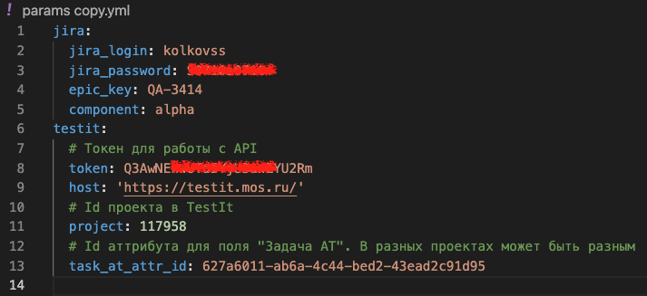

# Создание задач в Jira из тест-кейсов TestIT

Данный инструмент позволяет быстро создать в джире задачки по автоматизации тестов по их id в TestIt.
Достаточно перечислить нужные id в списке и программа автоматически создаст все необходимые задачи и пропишет их в соответствующий атрибут в TestIt.

## Требования к работе

- Ruby >= 3.2.2
- Наличие API токена в TestIt
- Доступ в Jira с возможностью создавать задачи

Необходимо заполнить файл `params.yml`:

- Свои логин и пароль от Jira
- Ключ эпика, в который будут создаваться задачи
- Название компонента для задач
- Хост инстанса TestIt
- Свой API токен TestIt
- Id проекта TestIt
- Id атрибута "Связанная задача АТ" (можно посмотреть в девтулзе)

Пример заполненного файла:



## Установка

Перейти в директорию

```
cd taskcreator
```

Установка гема bundler, если ещё не установлен

```
gem install bundler
```

Установка всех необходимых зависимостей локально

```
bundle
```
Заполнить файл tests.txt необходимыми id тестов из TestIt, каждый id c новой строки

Находясь в директории `taskcreator` выполнить:

```
bundle exec ruby app.rb
```
